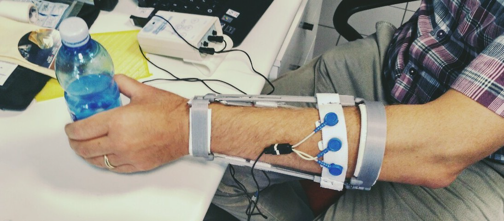

# LM_ElAp
# ElAp Cookbook: Build Instructions

This guide is part of the LM18 project repository, consisting of multiple components. Please read the disclaimers, consult the community, and ensure you understand all safety issues. This demonstration project is intended to showcase feasibility and encourage further development. It is not designed for general use but is aimed at professionals and skilled makers. Use this guide at your own risk; the author(s) decline any responsibility for its use.

## Overview

This document provides instructions for:
- Anthropomorphic adaptation
- Production
- Assembly of an assistive device for the upper extremity  

The design presented is one of several proposed options and may be incomplete; contributions to its improvement are encouraged.

Here is a list of designs
(to be completed)
###Telescopic version 
2017_LM_Assemblies
https://cad.onshape.com/documents/5853ad0faca8bd10d73a4eb4/w/684c10226072d89926558631/e/f64e184acf4b5f86f47905fd
###The 'Cage' version
https://cad.onshape.com/documents/a583dadaa18ebf65f9c03ea4/w/503938e0c779d2103932d57a/e/9c57e9612dafe9db4ced23d1
https://cad.onshape.com/documents/a4af5bdf97b7bb04d5ec520e/w/5e7ee876fdbaaa1006848999/e/4f3881beb608c8cdeab37899
###Stretchable version with spiral connectors
https://cad.onshape.com/documents/661382f7fa0e94bae04c481c/w/cea5bdd3a732ac9eed1e4dd4/e/cd3d6fee1f1f17e26b500b82

###Electronics Box
https://cad.onshape.com/documents/a49e85e83e1fc209c6c5f8bf/w/50d503d6a92421569452c3da/e/59b2ad8c414352f9c2713def

ElAp190301
https://cad.onshape.com/documents/a583dadaa18ebf65f9c03ea4/w/503938e0c779d2103932d57a/e/9c57e9612dafe9db4ced23d1
ElAp_sara
https://cad.onshape.com/documents/672b537dbdcf6389cad727a5/w/a1833756fe7f60467d7718d6/e/d8bd53e363bb51233679b63a
Elements Distal part & Proximal part
https://cad.onshape.com/documents/60b06854d1c632442cf35d04/w/5fe57d326bc8d7e14eb3da1b/e/6b0057fc8427c9e3e0252550
---

## 1. Personalize the 3D Model

### Steps:
1. Visit [Onshape](https://cad.onshape.com) and log in or create an account.
2. Search for the project models from the provided list.
3. Make a copy of the model using the **Make a Copy** button.
4. Modify the parametric design:
   - Adjust the `FOREARM LENGTH` and `FOREARM WIDTH` variables by double-clicking them in the left sidebar.
   - Insert personalized values in millimeters and confirm changes.
5. Review all components to ensure proper customization of dimensions.

### Export:
1. Right-click the **EXPORT 1** component in the taskbar.
2. Export settings:
   - **Format**: STL  
   - **Units**: Millimeters  
   - **Resolution**: Fine  
   - Check "Export parts as individual files."
3. Save the components as individual files for 3D printing.

---

## 2. Produce the Components with a 3D Printer

### Technology:
- Use an FDM 3D printer or consult a local or online 3D printing service.
- Alternative: SLS technology for maximum durability (increased cost, limited color options, and additional finishing requirements).
